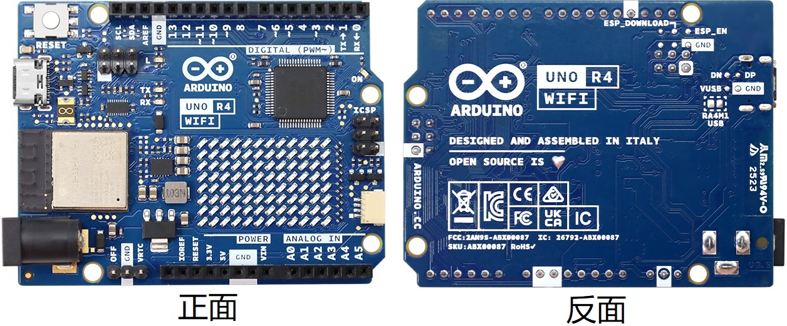
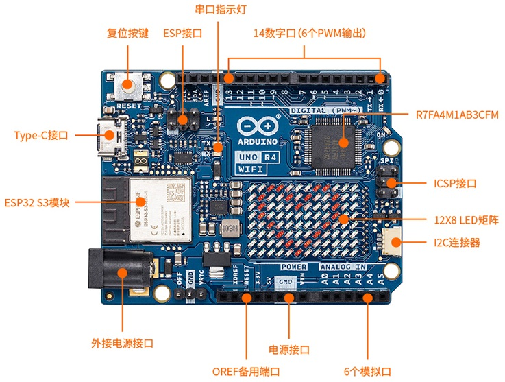

# UNO R4 主板介绍

---

## 一、UNO R4 WiFi 主板

---

1. 简介：

Arduino UNO R4 WiFi（以下简称 UNO R4 WiFi）是第一个具有32位微控制器和ESP32-S3 Wi-Fi®模块(ESP32-S3 mini -1- n8)的UNO板。它采用瑞萨电子公司的RA4M1系列微控制器(R7FA4M1AB3CFM#AA0)，基于48 MHz Arm®Cortex®-M4微处理器。

UNO R4 WiFi延续了UNO开发板的传统，具有14个数字I/O端⼝，6个模拟通道，专⽤于 I2C、SPI 和 UART 连接的引脚。它具有更⼤的内存：闪存（256kB）是之前的8倍，SRAM（32 kB）是之前的16倍。它的时钟速度为48 MHz，⽐之前的快3倍。

此外，它还具有ESP32-S3模块，⽤于Wi-Fi®和Bluetooth®连接，以及内置的 12x8 LED 矩阵，使其成为迄今为⽌最具视觉
效果的 Arduino 开发板之⼀。LED 矩阵是完全可编程的，12x8 LED 矩阵可⽤于显⽰动画、⽂本滚动、创建⼩游戏等，是赋予您的项⽬更多个性的完美功能。

同时，RA4M1的工作电压固定为5V，ESP32-S3模块为3.3V。这两个单片机之间的通信是通过一个逻辑级翻译器(TXB0108DQSR)进行的。

---

2. 特点：

R7FA4M1AB3CFM#AA0，通常称为RA4M1，是UNO R4 WiFi上的主MCU，连接到板上的所有引脚头以及所有通信总线。

- 概述：

  - 48 MHz Arm®Cortex®-M4微处理器，带浮点单元(FPU)。
  - 5V工作电压 
  - 实时时钟(RTC) 
  - 内存保护单元(MPU)
  - 数字模拟转换器(DAC)
  
- 内存：
  
  - 256kB 闪存
  - 32kB SRAM
  - 8 kB数据存储器(EEPROM)

- 外设：

  - 电容触摸传感单元(CTSU)
  - USB 2.0全速模块(USBFS)
  - 14位ADC
  - 高达12位DAC
  - 运算放大器(OPAMP)

- 电源：
  
  - RA4M1的工作电压为5V
  - 建议输入电压(VIN)为6V~24V
  - 桶形插孔连接⾄VIN引脚(6-24V)
  - 通过USB-C®供电,电压为5V

- 通讯：

  - 1x UART (引脚D0，D1)
  - 1x SPI(引脚D10-D13，ICSP头)
  - 1x I2C(引脚A4，A5，SDA，SCL)
  - 1x CAN (引脚D4，D5，需要外部收发器)

- ⼯作温度：-40℃~85℃

esp32 - s3 mini -1- n8是带有内置天线的次要MCU，用于Wi-Fi®和蓝牙®连接。该模块在3.3V电压上工作，使用逻辑级翻译器(TXB0108DQSR)与RA4M1通信。

- 概述：

  - Xtensa®双核32位LX7微处理器
  - 3.3V 工作电压
  - 40兆赫晶体振荡器

- Wi-Fi®：

  - Wi-Fi®支持802.11 b/g/n标准(Wi-Fi®4)
  - 比特率高达150 Mbps
  - 2.4 GHz频段

- Bluetooth®：

  - Bluetooth® 5

---

3. 功能概述：

3.1. 板卡介绍

| 参考 | 描述 |
| :--: | :--: |
| U1 | R7FA4M1AB3CFM#AA0 微控制器 IC |
| U2 | NLASB3157DFT2G 多路复⽤器 |
| U3| ISL854102FRZ-T 降压转换器 |
| U4 | TXB0108DQSR 逻辑电平转换器（5 V - 3.3 V） |
| U5 | SGM2205-3.3XKC3G/TR 3.3 V 线性稳压器 |
| U6 | NLASB3157DFT2G 多路复⽤器 |
| U_LEDMATRIX | 12x8 LED 红⾊矩阵 |
| M1 | ESP32-S3-MINI-1-N8 |
| PB1  | RESET 复位按钮 |
| JANALOG  | 模拟输⼊/输出针脚 |
| JDIGITAL | 数字输⼊/输出针脚 |
| JOFF | OFF, VRTC 针脚 |
| J1 | CX90B-16P USB-C® 连接器 |
| J2 | SM04B-SRSS-TB(LF)(SN) I2C 连接器 |
|  J3  |  ICSP 针脚（SPI） |
| J5   | 直流电源插孔  |
|  J6  | ESP 针脚  |
|  DL1   | LED TX（串⾏发送）  |
|  DL2   | LED RX（串⾏接收）  |
|  DL3   | LED 电源（绿⾊）  |
|  DL4   |LED SCK （串⾏时钟）   |
|  D1   |PMEG6020AELRX 肖特基⼆极管⼆极管   |
|  D2   |PMEG6020AELRX 肖特基⼆极管⼆极管   |
|  D3   | PRTR5V0U2X，215 ESD 保护  |

3.2. 微控制器 (R7FA4M1AB3CFM#AA0)

UNO R4 WiFi 基于Renesas的32位RA4M1系列微控制器R7FA4M1AB3CFM#AA0，它使⽤了⼀个48 MHz的Arm®Cortex®-M4微处理器，带有浮点运算单元 (FPU)。

RA4M1的⼯作电压固定为5 V，以便与基于之前的Arduino UNO板的屏蔽板、配件和电路兼容。

R7FA4M1AB3CFM#AA0的特点有：

- 256kB 闪存/32kB SRAM/8kB 数据闪存（EEPROM）
- 实时时钟 (RTC)
- 4x直接内存访问控制器 (DMAC)
- 14位ADC
- 最⾼12位DAC
- 运算放⼤器（OPAMP）
- CAN总线

3.3. Wi-Fi® / 蓝⽛® 模块（ESP32-S3-MINI-1-N8）

UNO R4 WiFi上的Wi-Fi®/蓝⽛® LE模块来⾃ESP32-S3 SoC。它采⽤Xtensa® 双核32位LX7 MCU，内置天线，⽀持2.4GHz频段。

ESP32-S3-MINI-1-N8的特点有：

- Wi-Fi® 4 - 2.4 GHz频段
- ⽀持蓝⽛® 5 LE
- 3.3V⼯作电压
- 384kB ROM
- 512kB SRAM
- 最⾼150 Mbps⽐特率
 
这个模块充当了UNO R4 WiFi上的次级MCU，并使⽤逻辑电平转换器与RA4M1 MCU通信。请注意：这个模块的⼯作电压是3.3V，⽽不是RA4M1的5V⼯作电压。

3.4. ESP 针脚

靠近RESET按钮的针座可⽤于直接访问ESP32-S3模块。可访问的引脚有：

- ESP_IO42 - MTMS 调试（引脚 1）
- ESP_IO41 - MTDI 调试（引脚 2）
- ESP_TXD0 - 串⾏传输（UART）（引脚 3）
- ESP_DOWNLOAD - 启动（引脚 4）
- ESP_RXD0-串⾏接收（UART）（引脚 5）
- GND - 接地（引脚 6）

3.5. USB 桥

对UNO R4 WiFi进⾏编程时，RA4M1 MCU默认通过ESP32-S3模块进⾏编程。通过向"P408 "引脚(D40)写⼊⾼电平状态，U2 和 U6 开关可将USB通信直接切换到RA4M1 MCU。

将SJ1焊盘焊接在⼀起可永久性地将USB通信直接设置为RA4M1，绕过ESP32-S3。

3.6. USB 连接器

UNO R4 WiFi有⼀个USB-C® 端⼝，⽤于开发板供电和编程，以及发送和接收串⾏通信。

注意： 通过USB-C® 端⼝为开发板供电的电压不得超过5V。

3.7. LED 矩阵

UNO R4 WiFi采⽤12x8的红⾊LED矩阵(U_LEDMATRIX)，使⽤⼀种称为查理普莱克斯法的技术连接。RA4M1 MCU上⽤于矩阵的引脚有：

- P003
- P004
- P011
- P012
- P013
- P015
- P204
- P205
- P206
- P212
- P213

这些LED可以通过特定库以数组形式访问。请参阅下⾯的映射：

该矩阵可⽤于多个项⽬和原型设计，⽀持动画、简单的游戏设计和滚动⽂本等。

3.8. 数字模拟转换器 (DAC)

UNO R4 WiFi的A0模拟引脚连接了⼀个分辨率⾼达12位的DAC。DAC⽤于将数字信号转换为模拟信号。

DAC可⽤于⾳频应⽤中的信号⽣成，如⽣成和改变锯⻮波。

3.9. I2C 连接器

I2C连接器SM04B-SRSS-TB(LF)(SN)连接到开发板上的⼀个次级I2C总线。注意： 该连接器通过3.3V供电。

该连接器还共享以下引脚连接：

JANALOG 针脚
- A4
- A5

JDIGITAL 针脚
- SDA
- SCL

注意： 由于A4/A5连接到主I2C总线，因此在使⽤总线时，不应将这些引脚⽤作ADC输⼊。不过，您可以同时将I2C设备连接到这些引脚和连接器上。

3.10. 电源选项

电源可通过VIN引脚或USB-C®连接器提供。如果通过VIN供电，ISL854102FRZ降压转换器会将电压降到5V。

VUSB和VIN引脚均连接⾄ISL854102FRZ降压转换器，并分别安装了肖特基⼆极管，⽤于极性反接和过压保护。

通过USB向RA4M1 MCU供电约 ~4.7V（由于肖特基电压降）。

线性稳压器（SGM2205-3.3XKC3G/TR）转换来⾃降压转换器或USB的5V电压，并为包括ESP32-S3模块在内的多个组件提供3.3V电压。

- 电源树

- 引脚电压
 
UNO R4 WiFi的⼀般⼯作电压为5V，但ESP32-S3模块的⼯作电压为3.3V。

注意： ESP32-S3的引脚（3.3 V）不得与RA4M1的任何引脚（5V）接触，否则可能损坏电路，这⼀点⾮常重要。

- 引脚电流
 
R7FA4M1AB3CFM#AA0微控制器上的GPIO可安全处理⾼达8mA的电流。切勿将电流更⼤的设备直接连接到GPIO，否则可能会损坏电路。

为舵机，电机等供电时，请务必使⽤外部电源。

---

4. 引脚:

4.1. 模拟

| 针脚 | 功能 |类型 | 描述 |
| :--: | :--: | :--: | :--: |
| 1 | BOOT  | NC | 未连接 |
| 2 | IOREF |IOREF | 数字逻辑参考电压 V - 连接⾄ 5 V |
| 3 | Reset  |重置 | 复位 |
| 4 |+3V3 | 电源 | +3V3 电源线 |
| 5 | +5V | 电源 | +5V 电源线 |
| 6 | GND | 电源 | 接地 |
| 7 | GND| 电源 | 接地 |
| 8 | VIN | 电源 | 电压输⼊ |
| 9 | A0  |模拟信号 | 模拟输⼊ 0 / DAC |
| 10 |A1 | 模拟信号 | 模拟输⼊ 1 / OPAMP+ |
| 11 | A2 | 模拟信号 | 模拟输⼊ 2 / OPAMP- |
| 12 |A3 | 模拟信号 | 模拟输⼊ 3 / OPAMPOut |
| 13 | A4 | 模拟信号 | 模拟输⼊ 4 / I2C 串⾏数据（SDA） |
| 14 | A5 | 模拟信号 | 模拟输⼊ 5 / I2C 串⾏时钟 (SCL) |

4.2. 数字

| 针脚 | 功能 |类型 | 描述 |
| :--: | :--: | :--: | :--: |
| 1 | SCL  | 数字信号 | I2C 串⾏时钟（SCL） |
| 2 | SDA  |数字信号| I2C 串⾏数据（SDA） |
| 3 | AREF  |数字信号 | 模拟参考电压 |
| 4 |GND | 电源 | 接地 |
| 5 | D13/SCK/CANRX0 | 数字信号 | GPIO 13 / SPI 时钟 / CAN 接收器 (RX) |
| 6 | D12/CIPO | 数字信号 | GPIO 12 / SPI 控制器输⼊外设输出|
| 7 | D11/COPI | 数字信号 |GPIO 11（PWM）/ SPI 控制器输出外设输⼊ |
| 8 | D10/CS/CANTX0 | 数字信号 | GPIO 10（PWM）/ SPI 芯⽚选择/CAN 发射器（TX） |
| 9 | D9  |数字信号 | GPIO 9 (PWM~) |
| 10 |D8 | 数字信号 | GPIO 8 |
| 11 | D7 | 数字信号 |GPIO 7 |
| 12 |D6 | 数字信号|GPIO 6 (PWM~) |
| 13 | D5 | 数字信号 | GPIO 5 (PWM~) |
| 14 | D4 | 数字信号 |GPIO 4 |
| 15   | D3   |  数字信号 |GPIO 3 (PWM~) / 中断引脚 |
| 16   |  D2  |数字信号 |GPIO 2 / 中断引脚 |
| 17   |  D1/TX0 |数字信号  | GPIO 1 / 串⾏ 0 发送器（TX） |
|  18  |  D0/TX0  |数字信号 | GPIO 0 / 串⾏ 0 接收器 (RX) |

4.3. 关闭

| 针脚 | 功能 |类型 | 描述 |
| :--: | :--: | :--: | :--: |
| 1 | OFF  |电源 | ⽤于控制电源 |
| 2 |GND  |电源 | 接地 |
| 1 |VRTC  |电源 |电池连接，仅为 RTC 供电 |

4.4. ICSP

| 针脚 | 功能 |类型 | 描述 |
| :--: | :--: | :--: | :--: |
| 1 |CIPO  | 内部功能 |控制器输⼊外设输出 |
| 2 | +5V  |内部功能 | 5V 电源 |
| 3 |SCK  |内部功能 |串⾏时钟 |
| 4 |COPI | 内部功能 |控制器输出外设输⼊ |
| 5 | RESET  | 内部功能 | 复位 |
| 6 |GND | 内部功能 |接地|

有关更多UNO R4 WiFi主板的资料请查阅连接：[https://docs.arduino.cc/hardware/uno-r4-wifi/](https://docs.arduino.cc/hardware/uno-r4-wifi/)

---

## 二、UNO R4 Minima 主板

---

1. 简介：

Arduino UNO R4 Minima（以下简称 UNO R4 Minima）是第⼀款采⽤ 32 位微控制器的UNO板。它采⽤了瑞萨电⼦（Renesas）（R7FA4M1AB3CFM#AA0）的 RA4M1 系列微控制器，内嵌了 48 MHz 的 Arm® Cortex®-M4 微处理器。

UNO R4 Minima 继承了UNO开发板的传统 具有标准的14个数字 I/O 端⼝，6个模拟通道，专⽤的 I2C、SPI 和 UART 连接引脚。它具有更⼤的内存：闪存增加了 8 倍（256 kB），SRAM 增加了 16 倍（32 kB）。所以，具有 256 kB 的闪存，32 kB 的 SRAM 和 8 kB 的数据存储器（EEPROM）。

UNO R4 Minima 板的⼯作电压是 5 V，使其与具有相同⼯作电压的 UNO 外形尺⼨的配件硬件兼容。因此，为以前的 UNO版本设计的扩展板可以安全地与该板⼀起使⽤，但由于微控制器的更换，不能保证软件兼容性。UNO R4 Minima板还有⼀个桶形插座连接器，⽀持 6-24 V 的输⼊电压。这种连接器⾮常流⾏，可以去除降低电压所需的额外电路。

---

2. 特点：

- R7FA4M1AB3CFM#AA0：

  - 48 MHz Arm® Cortex®-M4 微处理器，带有浮点单元（FPU）
  - 5V工作电压 
  - 实时时钟(RTC) 
  - 内存保护单元(MPU)
  - 数字模拟转换器(DAC)
  
- 内存：
  
  - 256kB 闪存
  - 32kB SRAM
  - 8 kB数据存储器(EEPROM)

- 引脚
  - 14 个数字引脚 (GPIO)，D0-D13
  - 6 个模拟输⼊引脚（ADC），A0-A5
  - 6 个 PWM 引脚：D3，D5，D6，D9，D10，D11

- 外设：

  - 电容触摸传感单元(CTSU)
  - USB 2.0全速模块(USBFS)
  - ⾼达14位ADC
  - 高达12位DAC
  - 运算放大器(OPAMP)

- 电源：
  
  - 工作电压为5V
  - 建议输入电压(VIN)为6V~24V
  - 桶形插孔连接⾄VIN引脚(6-24V)
  - 通过USB-C®供电，电压为5V
  - 肖特基⼆极管⽤于过压和反极性保护

- 通讯：

  - 1x UART (引脚D0，D1)
  - 1x SPI(引脚D10-D13，ICSP头)
  - 1x I2C(引脚A4，A5， SDA， SCL)
  - 1x CAN (引脚 D4，D5，需要外部收发器)

- ⼯作温度：-40℃~85℃

---

3. 功能概述：

3.1. 板卡介绍

| 参考 | 描述 |
| :--: | :--: |
| U1 | R7FA4M1AB3CFM#AA0 微控制器 IC |
| U2 | ISL854102FRZ-T 降压转换器 |
| PB1| 重置按钮 |
| JANALOG  | 模拟输⼊/输出针脚 |
| JDIGITAL | 数字输⼊/输出针脚 |
| J1 | ICSP 头（SPI）  |
| J2 |SWD/JTAG 连接器  |
| J3 |CX90B-16P USB-C® 连接器 |
|  J4  | DC 插孔  |
|  DL1   | LED TX（串⾏发送）  |
|  DL2   | LED RX（串⾏接收）  |
|  DL3   | LED 电源（绿⾊）  |
|  DL4   |LED SCK （串⾏时钟）   |
|  D2   |PMEG6020AELRX 肖特基⼆极管⼆极管   |
|  D3   |PMEG6020AELRX 肖特基⼆极管⼆极管   |
|  D4   | PRTR5V0U2X，215 ESD 保护  |

3.2. 微控制器（R7FA4M1AB3CFM#AA0）

UNO R4 Minima 基于来⾃瑞萨的 32 位 RA4M1 系列微控制器R7FA4M1AB3CFM#AA0，该微控制器采⽤ 48 MHz Arm®Cortex®-M4 微处理器和浮点单元 (FPU)。

在 UNO R4 Minima 上，⼯作电压固定为 5V，以便与旧版 UNO 设计的扩展板、配件和电路完全兼容。

R7FA4M1AB3CFM#AA0 特点：

- 256kB 闪存/32kB SRAM/8kB 数据闪存（EEPROM）
- 实时时钟 (RTC)
- 4x直接内存访问控制器 (DMAC)
- ⾼达14位ADC
- ⾼达12位DAC
- 运算放⼤器（OPAMP）
- CAN总线

3.3. USB 连接器

UNO R4 Minima 具有⼀个 USB-C® 端⼝，⽤于为您的板⼦供电和编程，以及发送和接收串⾏通信。

注意： 请勿通过 USB-C®端⼝以超过 5V 的电压给板⼦供电

3.4. 数字模拟转换器 (DAC)

UNO R4 Minima 具有连接到 A0 模拟引脚的 DAC，分辨率⾼达 12 位。DAC ⽤于将数字信号转换为模拟信号。

3.5. 电源选项

电源可以通过 VIN 引脚、桶形插孔或 USB-C® 连接器供应。如果电源通过 VIN 供应，则 ISL854102FRZ 降压转换器将电压降⾄ 5V。

VUSB、桶形插座连接器和 VIN 引脚与 ISL854102FRZ 降压转换器连接，分别采⽤肖特基⼆极管进⾏反向极性和过压保护。

通过 USB 供电，RA4M1 微控制器的电压约为~4.7 V（由于肖特基压降）。

- 电源树

- 引脚电压
 
UNO R4 Minima 在 5V 上运⾏，除了3.3V 引脚以外，该板上的所有引脚都是 5V。该引脚从 R7FA4M1AB3CFM#AA0 的VCC_USB引脚获取电源，并未连接到降压转换器。

- 引脚电流

R7FA4M1AB3CFM#AA0 微控制器上的 GPIO 可以处理⾼达8 mA的电流。请勿直接连接需要更⾼电流的设备到 GPIO。

如果您需要为需要更多功率的外部设备（例如伺服电机）提供电源，请使⽤外部电源。

4. 引脚:

4.1. 模拟

| 针脚 | 功能 |类型 | 描述 |
| :--: | :--: | :--: | :--: |
| 1 | BOOT  | MD | 模式选择 |
| 2 | IOREF |IOREF | 数字逻辑参考电压 V - 连接⾄ 5 V |
| 3 | Reset  |重置 | 复位 |
| 4 |+3V3 | 电源 | +3V3 电源线 |
| 5 | +5V | 电源 | +5V 电源线 |
| 6 | GND | 电源 | 接地 |
| 7 | GND| 电源 | 接地 |
| 8 | VIN | 电源 | 电压输⼊ |
| 9 | A0  |模拟信号 | 模拟输⼊ 0 / DAC |
| 10 |A1 | 模拟信号 | 模拟输⼊ 1 / OPAMP+ |
| 11 | A2 | 模拟信号 | 模拟输⼊ 2 / OPAMP- |
| 12 |A3 | 模拟信号 | 模拟输⼊ 3 / OPAMPOut |
| 13 | A4 | 模拟信号 | 模拟输⼊ 4 / I2C 串⾏数据（SDA） |
| 14 | A5 | 模拟信号 | 模拟输⼊ 5 / I2C 串⾏时钟 (SCL) |

4.2. 数字

| 针脚 | 功能 |类型 | 描述 |
| :--: | :--: | :--: | :--: |
| 1 | SCL  | 数字信号 | I2C 串⾏时钟（SCL） |
| 2 | SDA  |数字信号 | I2C 串⾏数据（SDA） |
| 3 | AREF  |数字信号 | 模拟参考电压 |
| 4 |GND | 电源 | 接地 |
| 5 | D13/SCK | 数字信号 | GPIO 13 / SPI 时钟  |
| 6 | D12/CIPO | 数字信号 | GPIO 12 / SPI 控制器输⼊外设输出|
| 7 | D11/COPI | 数字信号 |GPIO 11（PWM）/ SPI 控制器输出外设输⼊ |
| 8 | D10/CS| 数字信号 | GPIO 10（PWM）/ SPI 芯⽚选择|
| 9 | D9  |数字信号 | GPIO 9 (PWM~) |
| 10 |D8 | 数字信号 | GPIO 8 |
| 11 | D7 | 数字信号 |GPIO 7 |
| 12 |D6 | 数字信号|GPIO 6 (PWM~) |
| 13 |D5/CANRX0 | 数字信号 |GPIO 5（PWM~）/ CAN 发射器（TX） |
| 14 |D4/CANTX0 | 数字信号 |GPIO 4 / CAN 接收器（RX） |
| 15   | D3   |  数字信号 |GPIO 3 (PWM~) / 中断引脚 |
| 16   |  D2  |数字信号 |GPIO 2 / 中断引脚 |
| 17   |  D1/TX0 |数字信号  | GPIO 1 / 串⾏ 0 发送器（TX） |
|  18  |  D0/RX0  |数字信号 | GPIO 0 / 串⾏ 0 接收器 (RX) |

4.3. ICSP

| 针脚 | 功能 |类型 | 描述 |
| :--: | :--: | :--: | :--: |
| 1 |CIPO  | 内部功能 |控制器输⼊外设输出 |
| 2 | +5V  |内部功能 | 5V 电源 |
| 3 |SCK  |内部功能 |串⾏时钟 |
| 4 |COPI | 内部功能 |控制器输出外设输⼊ |
| 5 | RESET  | 内部功能 | 复位 |
| 6 |GND | 内部功能 |接地|

4.4. SWD/JTAG

| 针脚 | 功能 |类型 | 描述 |
| :--: | :--: | :--: | :--: |
| 1 |+5V  | 内部功能 |5V的电源 |
| 2 |SWDIO   |内部功能 | 数据输⼊/输出引脚 |
| 3 |GND  |内部功能 |接地 |
| 4 |SWCLK  | 内部功能 |时钟引脚 |
| 5 |GND  | 内部功能 | 接地 |
| 6 |NC | 内部功能 |未连接|
| 7 | RX | 内部功能 |串⾏接收器 |
|8  | TX  | 内部功能 |串⾏发射器 |
|  9| GND  | 内部功能 |接地 |
| 10 |NC  | 内部功能 | 未连接 |

有关更多UNO R4 WiFi主板的资料请查阅连接：[https://docs.arduino.cc/hardware/uno-r4-minima/](https://docs.arduino.cc/hardware/uno-r4-minima/)

